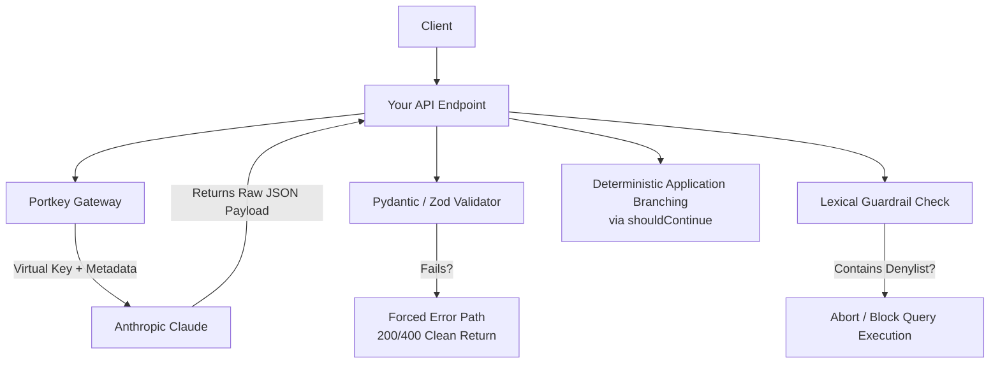
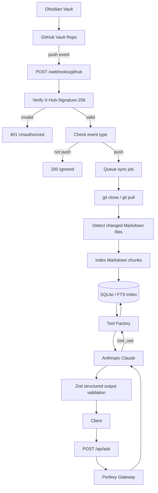

## Main Specs and Requirements



## Core idea:  CTF Research Copilot API

The idea: a user sends a question like:

> “Find my notes about APK dynamic analysis and summarize the recommended workflow.”

Your API calls **Claude through Portkey**, lets Claude use **2–3 tools over your local data**, validates every tool input/output, forces a **schema-valid final response**, and blocks any dangerous model-generated SQL/query before execution.

This fits the assignment perfectly because it demonstrates the four required patterns: gateway abstraction, structured output, tool factory with context, and generated-query guardrails.

This work is also inspired from the recent rumoured leaked info from Anthropic, revealing the use of thousands of linked notes that organize research, documentation and internal AI concepts, with this project we can leverage this idea, but on a smaller scale, as the notes taking during previous CTF competitions and trainings are very useful in solving new challenges, mimicking a sort of human behaviour, or more accurately, using a "second brain" to optimize the solve rate and timing.

**Why we chose syncing Obsidian notes from Github ?**
We all know that Obsidian is the leading note taking app available on the market, and the hosting of vaults online for sync is fairly doable, but it still requires a paid subscription. 

The CEO of Obsidian itself proposed some free ways to sync in a Reddit comment, and that inspired me to try using that for this project, as well as my extensive use of it and the decent amount of notes and writeups I published so far.
The idea also comes from the fact that solves are most of the time a collaboration of all the team members, and considering the delegation of tasks by categories, makes syncing everything into an organization GitHub repo more optimized and suitable for collaborative team work.





## BUILD ORDER 

1. Fastify backend
2. GitHub webhook endpoint
3. Signature verification
4. Sync job queue
5. Vault clone `/ pull`
6. Markdown changed-file detection
7. SQLite indexing
8. `/api/index/status`
9. `/api/ask` with Claude + Portkey
10. Tools over indexed notes


The service is provider-swappable through Portkey. The submitted demo uses Gemini because Claude credits were unavailable, but the code path supports swapping to Claude by changing AI_MODEL to @anthropic-slug/claude-...

# Testing checklist

You need these tests:
Webhook security:
- [x] accepts valid GitHub signature ✅ 2026-07-08
- [x] rejects invalid signature ✅ 2026-07-08
- [x] rejects missing signature ✅ 2026-07-08
- [x] ignores non-push event ✅ 2026-07-08

Sync:
- [x] clones repo if vault-cache does not exist ✅ 2026-07-08
- [x] pulls repo if vault-cache exists ✅ 2026-07-08
- [x] indexes only .md files ✅ 2026-07-08
- [x] ignores `.obsidian` and attachments ✅ 2026-07-08

Indexing:
- [x] chunks Markdown by headings ✅ 2026-07-08
- [x] skips unchanged files by hash ✅ 2026-07-08
- [x] updates changed files ✅ 2026-07-08

AI gate later:
- [ ] final Claude output validates with Zod
- [ ] forced error path works
- [x] malicious generated SQL is blocked (SQLi) ✅ 2026-07-08
* Fun fact: As my last name abreviation is SQL and i'm the Web Exploitation player in my ctf team, my nickname is SQL injection

---

# Best MVP target

For your next milestone, we will try to focus on building only this:

```
* POST /webhooks/github | GET /api/index/status | POST /api/syncSQLite 
* Markdown index
```

Then prove:

```
I push to my Obsidian vault GitHub repo.GitHub calls my webhook.My service verifies the signature.My service pulls the latest vault.My service indexes Markdown notes.The status endpoint shows updated documents/chunks.
```

After that, adding Claude + Portkey tools becomes clean because the data layer is already alive.

![[Attachments/Week 1  - Backend AI Engineering Assignment-1783526288498.webp]]webhook ping is good

testing the API is good ![[Attachments/Week 1  - Backend AI Engineering Assignment-1783528093955.webp]]


Sync: ok ![[Attachments/Week 1  - Backend AI Engineering Assignment-1783530560015.webp]]